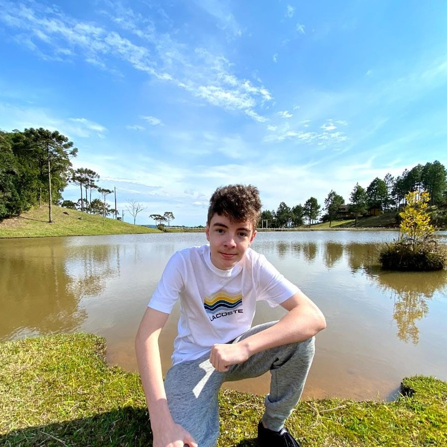

# Portfolio 3º ano do ensino médio

 

eu nome é João Paulo Broering tenho 16 anos e estou cursando o ensino médio com curso tecnico integrado, a função desse diretorio é somente conter as atividades da parte de TI. Para acessar o portfólio do ensino médio padrão clique no botão abaixo

 

## Este é o portfólio referente ao período do 1º trimestre do 3º ano do ensino médio que contém:
* Principais atividades para desenvolvimento pessoal
* Documentos explicando como foi o processo de desenvolvimento das atividades
* Processos a parte das atividades propostas da escola

### 1º Trimestre
#### Banco de dados

Eu coloquei essa atividade que envolveu a maior parte das coisas que aprendemos esse ano, até a parte de exportar e importar tabelas

 

#### Modelagem de Sistemas

Coloquei essa atividade que tem sobre o conteudo mais recente(que eu estava na aula) que aprendemos

 

Abaixo esta um dos resumos que tinha feito sobre modelagem de sistemas

 

#### Programação de Aplicativos

Achei essa atividade incrivel por ter todas as principais atividades do trimestre no mesmo app

 

Coloquei um material que usei para estudar para a prova

 

#### Testes de Sistemas

Coloquei essa atividade por ter uma mecanica diferente, de ter que fazer um projeto com defeito e o outro grupo ter que descobrir

 

### 2º Trimestre
#### Banco de dados

Eu coloquei essa atividade que envolveu a maior parte das coisas que aprendemos esse ano, até a parte de exportar e importar tabelas

 

#### Modelagem de Sistemas

Coloquei essa atividade que tem sobre o conteudo mais recente(que eu estava na aula) que aprendemos

 

Abaixo esta um dos resumos que tinha feito sobre modelagem de sistemas

 

#### Programação de Aplicativos

Achei essa atividade incrivel por ter todas as principais atividades do trimestre no mesmo app

 

Coloquei um material que usei para estudar para a prova

 

#### Testes de Sistemas

Coloquei essa atividade por ter uma mecanica diferente, de ter que fazer um projeto com defeito e o outro grupo ter que descobrir

 

